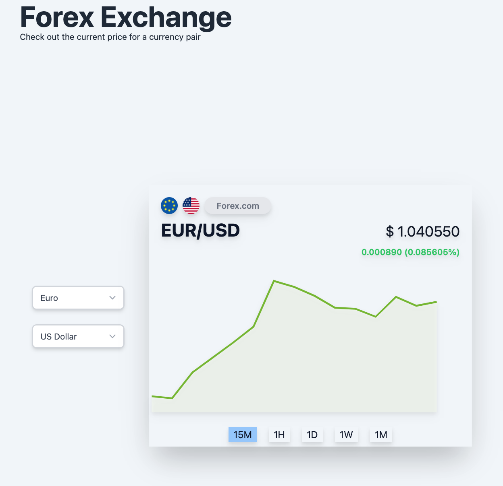

This is a [Next.js](https://nextjs.org/) project bootstrapped with [`create-next-app`](https://github.com/vercel/next.js/tree/canary/packages/create-next-app).

## Getting Started

Create a `.env.local` file in your local root directory. Add your API Keys

```
NEXT_PUBLIC_API_KEY=your_api_key
NEXT_PUBLIC_SOCKET_API_KEY=your_socket_api_key
```

Then, run the development server:

```bash
npm run dev
# or
yarn dev
```

Open [http://localhost:4444](http://localhost:4444) with your browser to see the result.

## Screenshots


